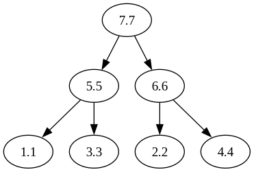
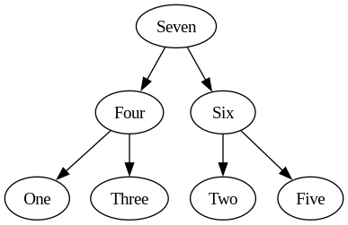
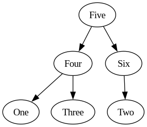

********
Max Heap
********

The ``heap.h`` header file provides an implementation of the Max-Heap data 
structure in C. A Max-Heap is a specialized binary tree-based data structure 
that ensures that the parent nodes always have values greater than their 
child nodes. This fundamental property makes Max-Heaps valuable in various 
algorithms and applications.

- **Priority Queues**: Max-Heaps efficiently maintain a collection of elements with associated priorities, ensuring that the element with the highest priority (largest value) can be quickly accessed and removed.

- **Heap Sort**: Max-Heaps serve as a core component of the heap sort algorithm, an efficient in-place sorting technique that can be used to sort an array of elements in descending order.

- **Graph Algorithms**: Max-Heaps are often employed in graph algorithms, such as Prim's algorithm for finding the minimum spanning tree in a weighted graph.

Within this library, a Max-Heap exhibits the following properties:

- Max-Heaps are binary trees where each parent node's value is greater than those of its child nodes.

- The largest element in the Max-Heap is always located at the root, making it accessible in constant time.

- Max-Heaps can be efficiently used to add elements with higher values at the top and remove the largest element, making them suitable for priority queue operations.

In the context of this library, a Max-Heap is implemented as an array, where the child nodes exist at indices :math:`2i+1` and :math:`2i+2` relative to the parent node at index :math:`i`.

This library offers functions to create, manage, and interact with Max-Heaps, allowing developers to utilize this data structure for solving a wide range of problems efficiently.

For detailed usage and function references, refer to the library documentation.

Structure
=========
The ``heap.h`` header file utilizes the following structure to manage 
dynamically allocated heap structures. The struct is encoded as a macro that can be 
easily expanded for various data types.

.. role:: c(code)
   :language: c

.. code-block:: c

   #define HEAP_STRUCT(type, dat_type)           \
       typedef struct {                            \
           type *data;                             \
           size_t len;                             \
           size_t alloc;                           \
       } dat_type;

Parameters
----------

- :c:`type`: The data type that the struct will be instantiated for.
- :c:`dat_type`: The derived data type that will describe the struct.

Attributes
----------

- :c:`data`: A pointer to the array of type ``type``.
- :c:`len`: The length of the vector measured in the number of indices.
- :c:`alloc`: The number of indices allocated in memory.

.. _max_heap_dat_type:

Derived Data Types 
------------------
The ``HEAP_STRUCT`` macro is pre-instantiated within the ``heap.h``
header file for these data types. The code example below shows the 
derived data type name for each data type and the corresponding data type 
that will be contained in array form within the struct. The ``str``
data type is further described in the :ref:`String <string_struct>` section of this document.

.. code-block:: c 

   HEAP_STRUCT(char, char_max_hp);
   HEAP_STRUCT(unsigned char, uchar_max_hp);
   HEAP_STRUCT(short int, short_max_hp);
   HEAP_STRUCT(unsigned short int, ushort_max_hp);
   HEAP_STRUCT(int, int_max_hp);
   HEAP_STRUCT(unsigned int, uint_max_hp);
   HEAP_STRUCT(long int, long_max_hp);
   HEAP_STRUCT(unsigned long int, ulong_max_hp);
   HEAP_STRUCT(long long int, llong_max_hp);
   HEAP_STRUCT(unsigned long long int, ullong_max_hp);
   HEAP_STRUCT(float, float_max_hp);
   HEAP_STRUCT(double, double_max_hp);
   HEAP_STRUCT(long double, ldouble_max_hp);
   HEAP_STRUCT(bool, bool_max_hp);
   HEAP_STRUCT(str, string_max_hp);

.. _max_heap_type_enum:

Enum Data Types 
===============
This ``heap.h`` header file relies on the ``dtype`` enum stored in ``admin.h``
to identify the data type of an instantiated vector.  The possible enum values
that can be used are shown below and are further described in the upcoming sections 
of this document.

.. code-block:: c

   typedef enum {
       dChar,  // Keyword for a char data type as an integer data type 
       dUChar,  // keyword for unsigned char data type as an integer data type 
       dShort,  // Keyword for short int data type 
       dUShort,  // Keyword for unsigned short int data type 
       dInt,  // Keyword for int data type 
       dUInt,  // Keyword for unsigned int data type 
       dLong,  // Keyword for long int data type 
       dULong,  // Keyword for unsigned long int data type 
       dLongLong,  // Keyword for long long int data type 
       dULongLong,  // Keyword for unsigned long long int data type 
       dFloat,  // Keyword for float data type 
       dDouble,  // Keyword for double data type 
       dLDouble,  // Keyword for long double data type 
       dBool,  // Keyword for bool data type 
       dString  // Keyword for str data type
   } dtype;

Initialize Vector 
=================
The ``heap.h`` header file provides the ``init_max_heap`` function for 
initializing dynamically allocated heap structures. This function is essentially a 
function pointer, intelligently selecting the appropriate initialization 
function based on the specified data type.

.. code-block:: c

   type init_max_heap(dtype dat_type)(size_t buff);

Parameters 
----------

- :c:`dat_type`: The data type for the vector, represented by a ``dtype`` enum keyword as described in :ref:`Enum Data Types <heap_type_enum>`.
- :c:`buff`: An initial buffer size, indicating the number of indices to be allocated.

Returns
-------

- :c:`type`: A struct representing the vector of the specified type, as outlined in the :ref:`Derived Data Types <heap_dat_type>` section.

.. note:: The buffer size is only a guess, if the user exceeds this value, the underyling functions will allocate more memory in a geometric fashion, until the arrays becomes to large and then it will allocate in a linear fashion.

Error Handling
--------------
The ``init_max_heap`` macro has one primary failure mechanism, which is a failure 
to allocate memory.  If this occurs, the underlying functions will return a 
NULL pointer in place of the data struct, and will also set the value of 
``errno`` to ``ENOMEM``.  The developer can check for any of these two 
conditions to determine if an error occurred.

Possible error codes:

- ``ENOMEM``: Indicates a failure to allocate memory.

Example 
-------
Below is an example of using the ``init_max_heap`` function to create a dynamically 
allocated vector of type ``float_max_hp`` with an initial capacity of 5 indices.

.. code-block:: c 

   #include "heap.h"

   int main() {
       float_max_hp* vec = init_max_hp(dFloat)(5);
       if (vec == NULL) {
           fprintf(stderr, "Error: Memory allocation failure\n");
           return EXIT_FAILURE;
       }
       // Operations on the vector...
       // Remember to free dynamically allocated memory
       free_max_heap(vec);
       return EXIT_SUCCESS;
   }

.. note:: The ``init_max_heap`` function abstracts the complexity of vector initialization, providing a straightforward way to instantiate heap structures. It is crucial to manage the memory of these heap's properly, which includes freeing them after use.

Underlying Functions 
--------------------
The ``init_max_heap`` selects from one of the functions below to initialize 
a dynamically allocated array.  If the user desires, they can directly select 
one of these functions instead of using the ``init_max_heap`` function.

.. code-block:: c

   char_max_hp* init_char_max_heap(size_t buff);
   uchar_max_hp* init_uchar_max_heap(size_t buff);
   short_max_hp* init_short_max_heap(size_t buff);
   ushort_max_hp* init_ushort_max_heap(size_t buff);
   int_max_hp* init_int_max_heap(size_t buff);
   uint_max_hp* init_uint_max_heap(size_t buff);
   long_max_hp* init_long_max_heap(size_t buff);
   ulong_max_hp* init_ulong_max_heap(size_t buff);
   llong_max_hp* init_llong_max_heap(size_t buff);
   ullong_max_hp* init_ullong_max_heap(size_t buff);
   float_max_hp* init_float_max_heap(size_t buff);
   double_max_hp* init_double_max_heap(size_t buff);
   ldouble_max_hp* init_ldouble_max_heap(size_t buff);
   bool_max_hp* init_bool_max_heap(size_t buff);
   string_max_hp* init_string_max_heap(size_t buff);

Free Max Heap 
=============
The Max Heap data structure is implemented as a dynamically allocated array
of data.  As a result of the dynamic nature of this algorithm with information 
stored on the heap, the structure must be manually free from memory at the 
end of its utility.  The ``free_max_heap`` macro can be used to free 
a heap data structure at the end of its life.  The macro, implemented 
with a ``_Generic`` operator is shown below.

.. code-block:: c 

   #define free_max_heap(heap)  (/*Expressions to free memory */)  

Parameters 
----------

- :c:`heap`: A derived data type as a :ref:`Heap Data Type <max_heap_dat_type>`.

Underlying Functions 
--------------------
The ``free_max_heap`` macro is the preferred method for freeing min heap 
data structures from memory.  However, a user can instead use one of the 
underlying functions which are shown below.

.. code-block:: c 

   void free_char_max_heap(char_max_hp* vec);
   void free_uchar_max_heap(uchar_max_hp* vec);
   void free_short_max_heap(short_max_hp* vec);
   void free_ushort_max_heap(ushort_max_hp* vec);
   void free_int_max_heap(int_max_hp* vec);
   void free_uint_max_heap(uint_max_hp* vec);
   void free_long_max_heap(long_max_hp* vec);
   void free_ulong_max_heap(ulong_max_hp* vec);
   void free_llong_max_heap(llong_max_hp* vec);
   void free_ullong_max_heap(ullong_max_hp* vec);
   void free_float_max_heap(float_max_hp* vec);
   void free_double_max_heap(double_max_hp* vec);
   void free_ldouble_max_heap(ldouble_max_hp* vec);
   void free_bool_max_heap(bool_max_hp* vec);
   void free_string_max_heap(string_max_hp* vec);

Garbage Collection with Heap
============================
Dynamically allocated heap structures require explicit deallocation to free memory. 
While developers often manually manage this using functions like ``free_max_heap``, 
those compiling with GCC or Clang compilers have an alternative: automatic 
garbage collection using a macro. This feature leverages the `cleanup` 
attribute available in these compilers and is not part of the standard C language.

The macro follows the naming convention ``gbc_<type>``, where ``<type>`` 
corresponds to the derived data types mentioned in :ref:`Derived Data Types <max_heap_dat_type>`.

Example 
-------
Below is an example demonstrating the use of garbage collection with a 
``float_max_hp`` vector. Notice the absence of a manual ``free_max_heap`` 
call; the ``gbc_float_max_hp`` macro ensures automatic deallocation when the 
variable goes out of scope.

.. code-block:: c

   #include "heap.h"

   int main() {
       float_max_hp* vec gbc_float_max_hp = init_max_heap(dFloat)(4);
       enqueue_max_heap(vec, 1.1);
       enqueue_max_heap(vec, 2.2); 
       enqueue_max_heap(vec, 3.3);
       enqueue_max_heap(vec, 4.4);
       // Automatic cleanup happens here when vec goes out of scope
       return 0;
   }

Enqueue Max Heap 
================

The ``enqueue_max_heap`` function allows users to insert data into a max-heap 
data structure while preserving the heap invariance principles. This function 
is implemented as a macro with type safety provided by the ``_Generic`` operator.

Function Signature
------------------

.. code-block:: c

   #define enqueue_max_heap(heap, element) ( /* expressions to enqueue data */)

Parameters 
----------

- ``heap`` (Min Heap Data Structure): A data structure consistent with a :ref:`Max Heap Derived Type <max_heap_dat_type>` to which the element will be inserted.
  
- ``element`` (Type Consistent with ``heap``): Data of a type consistent with the ``heap`` to be inserted into a min heap data structure.

Returns 
-------

- ``true`` if the function executes successfully, indicating that the element was added to the min-heap.
- ``false`` if an error occurs during execution.

Error Handling
--------------

The ``enqueue_max_heap`` macro selects the appropriate iterator based on the 
vector's data type. If an error occurs, such as an invalid vector type or 
memory allocation failure, the underlying functions set ``errno`` to indicate 
the specific error.

Possible error codes:

- ``EINVAL``: Invalid argument was passed to the function.
- ``ENOMEM``: Memory allocation failure.

Example 
-------

Here's an example showing how to enqueue data into a min heap and how it is 
stored in a dynamically allocated vector:

.. code-block:: c

   #include "heap.h"
   #include "print.h"

   int main() {

        float a[7] = {5.5, 1.1, 2.2, 3.3, 6.6, 4.4, 7.7};
        float_max_hp* heap = init_max_heap(dFloat)(7);
        for (size_t i = 0; i < 7; i++) {
            enqueue_max_heap(heap, a[i]);
        }
        print(heap);
        free_max_heap(heap);
        return 0;
   }

Expected Output:

.. code-block:: bash 

   >> [ 7.7, 5.5, 6.6, 1.1, 3.3, 2.2, 4.4 ]

The array represents the following binary tree 

Underlying Functions 
--------------------

While the ``enqueue_max_heap`` macro is the recommended approach due to its ease 
of use and type safety, direct use of underlying functions is also possible. 
These functions are particularly useful in scenarios where more control or 
specific behavior is required.

.. code-block:: c 

   bool enqueue_max_heap_char(char_max_hp* heap, char element);
   bool enqueue_max_heap_uchar(uchar_max_hp* heap, unsigned char element);
   bool enqueue_max_heap_short(short_max_hp* heap, short int element);
   bool enqueue_max_heap_ushort(ushort_max_hp* heap, unsigned short int element);
   bool enqueue_max_heap_int(int_max_hp* heap, int element);
   bool enqueue_max_heap_uint(uint_max_hp* heap, unsigned int element);
   bool enqueue_max_heap_long(long_max_hp* heap, long int element);
   bool enqueue_max_heap_ulong(ulong_max_hp* heap, unsigned long int element);
   bool enqueue_max_heap_llong(llong_max_hp* heap, long long int element);
   bool enqueue_max_heap_ullong(ullong_max_hp* heap, unsigned long long int element);
   bool enqueue_max_heap_float(float_max_hp* heap, float element);
   bool enqueue_max_heap_double(double_max_hp* heap, double element);
   bool enqueue_max_heap_ldouble(ldouble_max_hp* heap, long double element);
   bool enqueue_max_heap_bool(bool_max_hp* heap, bool element);
   bool enqueue_max_heap_string(string_max_hp* heap, char* element);

Heap Length 
===========
A user can get the length of the heap data structure from the ``len``
attribute of the struct.  However, this can be dangerous because it 
allows a user to accidentally overwrite the parameter, which could 
lead to undefined behavior. In stead, The ``heap_length`` macro will safely 
return the length of the heap data structure 
to the user.  The macro uses the ``_Generic`` keyword to select from the 
appropriate underlying function while maintaining type safety.

.. code-block:: c

   #define heap_length(heap) ( /*Expressions to find heap length*/) 

Parameters 
----------

- :c:`heap`: A heap data structure of the :ref:`Max Heap Derived Type <max_heap_dat_type>`  type.

Returns 
-------

- The length of the heap data structure as a ``size_t`` data type.

Error Handling
--------------

The ``heap_length`` macro selects the appropriate function based on the 
vector's data type. If an error occurs, such as an invalid vector type, 
the underlying functions set ``errno`` to indicate 
the specific error.

Possible error codes:

- ``EINVAL``: Invalid argument was passed to the function.

Example 
-------
An example showing the use of the heap length 

.. code-block:: c

   #include "heap.h"
   #include "print.h"

   int main() {

       float a[5] = {2.2, 3.3, 6.6, 4.4, 7.7};
        float_max_hp* heap = init_max_heap(dFloat)(7);
        for (size_t i = 0; i < 5; i++) {
            enqueue_max_heap(heap, a[i]);
        }
        print(heap_length(heap));
        free_max_heap(heap);
        return 0;
   }

Expected Output:

.. code-block:: bash 

   >> 5

Underlying Functions 
--------------------
While it is preferred that a user implement the ``heap_memory`` macro to 
find the heap memory, a user can also implement one of the type specific 
functions listed below.

.. code-block:: c

   size_t char_max_heap_memory(char_max_hp* vec);
   size_t uchar_max_heap_memory(uchar_max_hp* vec);
   size_t short_max_heap_memory(short_max_hp* vec);
   size_t ushort_max_heap_memory(ushort_max_hp* vec);
   size_t int_max_heap_memory(int_max_hp* vec);
   size_t uint_max_heap_memory(uint_max_hp* vec);
   size_t long_max_heap_memory(long_max_hp* vec);
   size_t ulong_max_heap_memory(ulong_max_hp* vec);
   size_t llong_max_heap_memory(llong_max_hp* vec);
   size_t ullong_max_heap_memory(ullong_max_hp* vec);
   size_t float_max_heap_memory(float_max_hp* vec);
   size_t double_max_heap_memory(double_max_hp* vec);
   size_t ldouble_max_heap_memory(ldouble_max_hp* vec);
   size_t bool_max_heap_memory(bool_max_hp* vec);
   size_t string_max_heap_memory(string_max_hp* vec);

Heap Memory
===========
A user can find the memory of the heap data structure from the ``alloc``
attribute of the struct.  However, this can be dangerous because it 
allows a user to accidentally overwrite the parameter, which could 
lead to undefined behavior. In stead, The ``heap_memory`` macro will safely 
return the memory of the heap data structure 
to the user.  The macro uses the ``_Generic`` keyword to select from the 
appropriate underlying function while maintaining type safety.

.. code-block:: c

   #define heap_memory(heap) ( /*Expressions to find heap memory*/) 

Parameters 
----------

- :c:`heap`: A heap data structure of the :ref:`Max Heap Derived Type <max_heap_dat_type>`  type.

Returns 
-------

- The memory of the heap data structure as a ``size_t`` data type.  The memory represents the number of allocated indices.

Error Handling
--------------

The ``heap_memory`` macro selects the appropriate function based on the 
vector's data type. If an error occurs, such as an invalid vector type, 
the underlying functions set ``errno`` to indicate 
the specific error.

Possible error codes:

- ``EINVAL``: Invalid argument was passed to the function.

Example 
-------
An example showing the use of the heap memory 

.. code-block:: c

   #include "heap.h"
   #include "print.h"

   int main() {

       float a[5] = {2.2, 3.3, 6.6, 4.4, 7.7};
       float_max_hp* heap = init_max_heap(dFloat)(7);
       for (size_t i = 0; i < 5; i++) {
           enqueue_max_heap(heap, a[i]);
       }
       print(heap_memory(heap));
       free_max_heap(heap);
       return 0;
   }

Expected Output:

.. code-block:: bash 

   >> 7

Underlying Functions 
--------------------
While it is preferred that a user implement the ``heap_memory`` macro to 
find the heap memory, a user can also implement one of the type specific 
functions listed below.

.. code-block:: c

   size_t char_max_heap_memory(char_max_hp* vec);
   size_t uchar_max_heap_memory(uchar_max_hp* vec);
   size_t short_max_heap_memory(short_max_hp* vec);
   size_t ushort_max_heap_memory(ushort_max_hp* vec);
   size_t int_max_heap_memory(int_max_hp* vec);
   size_t uint_max_heap_memory(uint_max_hp* vec);
   size_t long_max_heap_memory(long_max_hp* vec);
   size_t ulong_max_heap_memory(ulong_max_hp* vec);
   size_t llong_max_heap_memory(llong_max_hp* vec);
   size_t ullong_max_heap_memory(ullong_max_hp* vec);
   size_t float_max_heap_memory(float_max_hp* vec);
   size_t double_max_heap_memory(double_max_hp* vec);
   size_t ldouble_max_heap_memory(ldouble_max_hp* vec);
   size_t bool_max_heap_memory(bool_max_hp* vec);
   size_t string_max_heap_memory(string_max_hp* vec);

Dequeue Max Heap 
================
The ``dequeue_max_heap`` macro can be used to dequeue an object from a Max 
Heap data structure and return that object to the user.  When an object is 
dequeued from a Min Heap data structure, the data within the structure 
is re-organized to maintain the Min Heap properties where all lower level 
nodes are smaller than the parent node.  The ``dequeue_max_heap`` macro 
utilyzes the ``_Generic`` keyword to select the appropriate function 
that maintains type safety.

.. code-block:: c

   #define define_max_heap(heap)  ( /* Expression to dequeue an object */ ) 
   
Parameters
----------

- :c:`heap`: A heap data structure of the :ref:`Max Heap Derived Type <max_heap_dat_type>`  type.

Returns 
-------

- Returns the minimum object in the Min Heap data structure.

.. note:: The ``dequeue_max_heap`` macro will return a value of 0 if an error is encountered, unless the data type is ``bool_max_hp`` or ``string_max_hp`` in which the function will return ``false`` or NULL respectively.

Error Handling
--------------

The ``dequeue_max_heap`` macro selects the appropriate iterator based on the 
vector's data type. If an error occurs, such as an invalid vector type or 
memory allocation failure, the underlying functions set ``errno`` to indicate 
the specific error.

Possible error codes:

- ``EINVAL``: Invalid argument was passed to the function.
- ``ENOMEM``: Memory allocation failure.

Example 
-------
An example showing how to dequeue a string object.  In this instance for 
string values, the order of the binary tree is alphabetical and not the 
numerical values described by each string.

.. code-block:: c

   #include "heap.h"
   #include "print.h"

   int main() {
       string_max_hp* init_max_heap(dString)(7);
       char* a[7] = {"One", "Two", "Three", "Four", "Five", "Six", "Seven"};
       string_max_hp* heap = init_max_heap(dString)(7);
       print("Original Heap Array: ", heap);
       for (size_t i = 0; i < 7; i++) {
           enqueue_max_heap(heap, a[i]);
       }
       str* val = dequeue_max_heap(heap);
       print("Dequeued object: ", val);
       print("New Heap Array: ", heap);
       free_max_heap(heap);
       free_string(val);
       return 0;
   }

.. code-block:: bash 

      >> Original Heap Array: [ Seven, Four, Six, One, Three, Two, Five ] 
      >> Dequeued object: Seven
      >> New Heap Array: [ Five, Four, Six, One, Three, Two ] 

The initial array represents the following binary tree 

The array following the enqueue operation represents this binary tree.

Underlying Functions 
--------------------
The ``dequeue_max_heap`` macro is the preferred method to dequeue an object
from a Min Heap data structure.  However, the user of this library can also 
select from the underlying functions shown below that are specific to their 
data types.

.. code-block:: c

   char dequeue_max_heap_char(char_max_hp* heap);
   unsigned char dequeue_max_heap_uchar(uchar_max_hp* heap);
   short int dequeue_max_heap_short(short_max_hp* heap);
   unsigned short int dequeue_max_heap_ushort(ushort_max_hp* heap);
   int dequeue_max_heap_int(int_max_hp* heap);
   unsigned int dequeue_max_heap_uint(uint_max_hp* heap);
   long int dequeue_max_heap_long(long_max_hp* heap);
   unsigned long int dequeue_max_heap_ulong(ulong_max_hp* heap);
   long long int dequeue_max_heap_llong(llong_max_hp* heap);
   unsigned long long int dequeue_max_heap_ullong(ullong_max_hp* heap);
   float dequeue_max_heap_float(float_max_hp* heap);
   double dequeue_max_heap_double(double_max_hp* heap);
   long double dequeue_max_heap_ldouble(ldouble_max_hp* heap);
   bool dequeue_max_heap_bool(bool_max_hp* heap);
   str* dequeue_max_heap_string(string_max_hp* heap);

Replace Max Heap Index 
======================
Once data is populated in a Max Heap data structure, a user can replace 
data at a specified index with the ``replace_max_heap_index`` macro. Once the 
data has been replaced at the user defined index, the function will re-order 
the array to maintain the min heap invariate. The  macro uses the ``_Generic`` 
keyword to select from the appropriate underlying function while retaining type 
safety.

.. code-block:: c 

   #define replace_max_heap_index(heap, index, value) (/* Expression to replace data*/) 

Parameters 
----------

- :c:`heap`: A heap data structure of the :ref:`Max Heap Derived Type <max_heap_dat_type>`  type.
- :c:`index`: The index where data will be replaced as a ``size_t`` variable.
- :c:`value`: The value that will be used to replace the data at ``index``.  The data type of this variable must be consistent with the data type of ``heap``.

Returns 
-------

- Returns ``true`` if the function executes succesfully, ``false`` otherwise.

Error Handling
--------------

The ``replace_max_heap_index`` macro selects the appropriate function based on the 
vector's data type. If an error occurs, such as an invalid vector type or 
memory allocation failure, the underlying functions set ``errno`` to indicate 
the specific error.

Possible error codes:

- ``EINVAL``: Invalid argument was passed to the function.
- ``ENOMEM``: Memory allocation failure.

Example 
-------
This example demonstrates the process of changing the value of an index.

.. code-block:: c 

   #include "print.h"
   #include "heap.h"

   int main() {
       double a[7] = {5.5, 1.1, 2.2, 3.3, 6.6, 4.4, 7.7};
       double_max_hp* heap = init_max_heap(dDouble)(7);
       for (size_t i = 0; i < 7; i++) {
           enqueue_min_heap(heap, a[i]);
       }
       print("Heap Before: ", heap);
       replace_min_heap_index(heap, 2, 12.12);
       print("Heap After: ", heap);
       free_min_heap(heap);
       return 0;
   }

.. code-block:: bash

   >> Heap Before: [ 7.7, 5.5, 6.6, 1.1, 3.3, 2.2, 4.4 ] 
   >> Heap After: [ 7.7, 5.5, 2.2, 1.1, 3.3, 12.2, 4.4 ]

Underlying Functions 
--------------------
The ``replace_max_heap_index`` macro is the preferred method to dequeue an object
from a Min Heap data structure.  However, the user of this library can also 
select from the underlying functions shown below that are specific to their 
data types.

.. code-block:: c

   bool replace_char_max_heap_index(char_max_hp* heap, size_t index, char value);
   bool replace_uchar_max_heap_index(uchar_max_hp* heap, size_t index, unsigned char value);
   bool replace_short_max_heap_index(short_max_hp* heap, size_t index, short int value);
   bool replace_ushort_max_heap_index(ushort_max_hp* heap, size_t index, unsigned short int value);
   bool replace_int_max_heap_index(int_max_hp* heap, size_t index, int value);
   bool replace_uint_max_heap_index(uint_max_hp* heap, size_t index, unsigned int value);
   bool replace_long_max_heap_index(long_max_hp* heap, size_t index, long int value);
   bool replace_ulong_max_heap_index(ulong_max_hp* heap, size_t index, unsigned long int value);
   bool replace_llong_max_heap_index(llong_max_hp* heap, size_t index, long long int value);
   bool replace_ullong_max_heap_index(ullong_max_hp* heap, size_t index, unsigned long long int value);
   bool replace_float_max_heap_index(float_max_hp* heap, size_t index, float value);
   bool replace_double_max_heap_index(double_max_hp* heap, size_t index, double value);
   bool replace_ldouble_max_heap_index(ldouble_max_hp* heap, size_t index, long double value);
   bool replace_bool_max_heap_index(bool_max_hp* heap, size_t index, bool value);
   bool replace_string_max_heap_index(string_max_hp* heap, size_t index, char* value);

Replace Max Heap by Value 
=========================
This library does not contain a method to replace values in a Max Heap data 
structure, mostly becase their are many different methods for finding the 
current value to be changed.  The preferred method may vary greatly depending 
on user needs.  Instead, this library leaves it up to the user to develop their 
own method for finding the perferred index to be changed and then they can 
use the ``replace_max_heap_index`` method to change the value.
